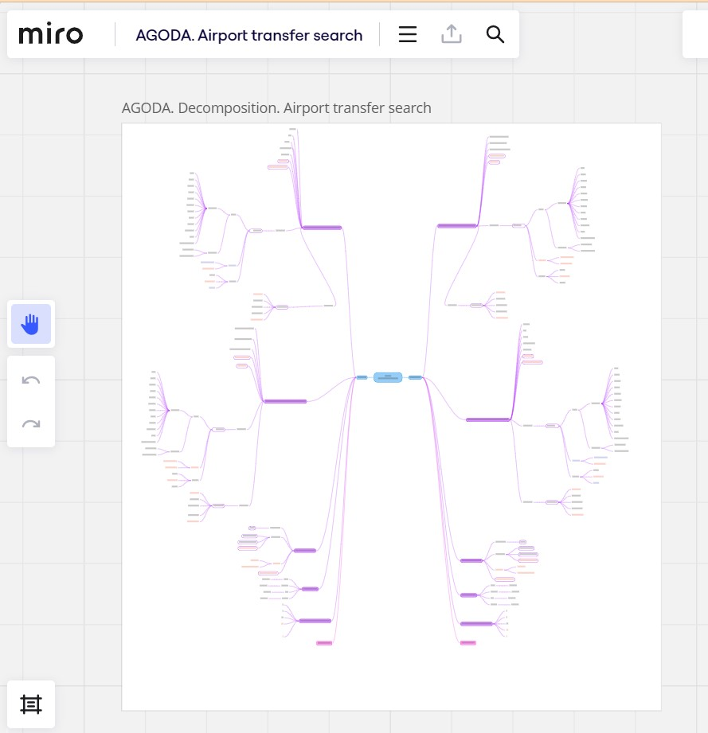

# Object decomposition for agoda .com website
Manual Software Testing

## Don't forget to give a :star: to make the project popular :) 

## :boom: The task and what needs to be done?
- Decompose an object on the agoda .com website.

- In the form of a mind map, write out the parameters and values of objects and (break everything down into equivalent classes and boundary values), for example, a search form, a hotel card in the search results, or objects on the hotel details page. 

- Sign up for testomat.io and write checklists or test cases for the objects you have chosen, take screenshots and prepare a report in pdf format.

## :bulb: The result:
The decomposition of the airport transfer search was selected and made : 'Agoda home page' > 'Airport transfer' > 'To airport'. 
Screenshots of checklists and test wounds in a pdf file.
Link to the decomposition scheme in Miro [Link][]

[Link]: https://miro.com/app/board/uXjVNPGZ0DE=/

Decomposition scheme
 

Test Run result
 

